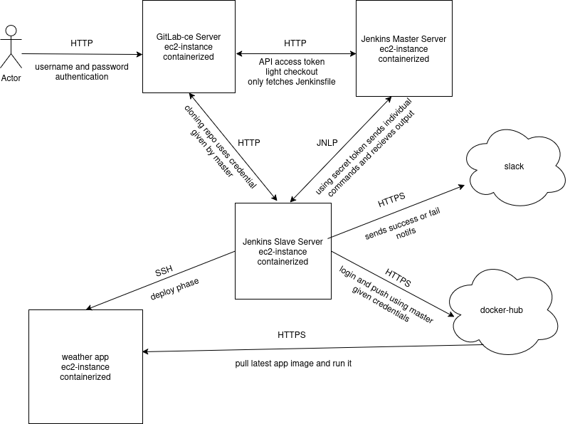

# CI/CD project:
This project is a ci/cd pipeline for my weather app.

Uses GitLab-ce server and a jenkins CI server.

All machines are ec2-instanses on AWS and all components are containerized.

Latest app image is publicly available on dockerhub.

This repo holds the configuration files for the jenkins server and agent

This repo also holds the Jenkinsfile

The original weather app src is in a selfhosted GitLab-ce server

and was copied to Github without the Jenkinsfile

## Links:

[dockerhub repository](https://hub.docker.com/r/hilelsagi/sagi_weather_app_img)

[Slack Workspace](https://app.slack.com/client/T08DS1QJJHH/C08DBHB90JK)

## Visual Description of Pipeline Flow:

## Componnents Diagram:

